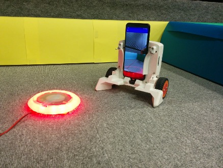
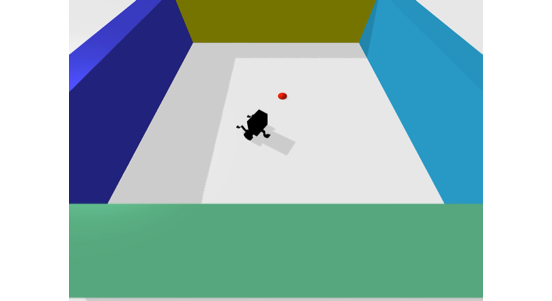
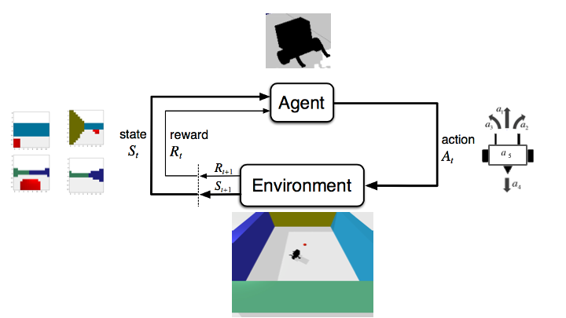
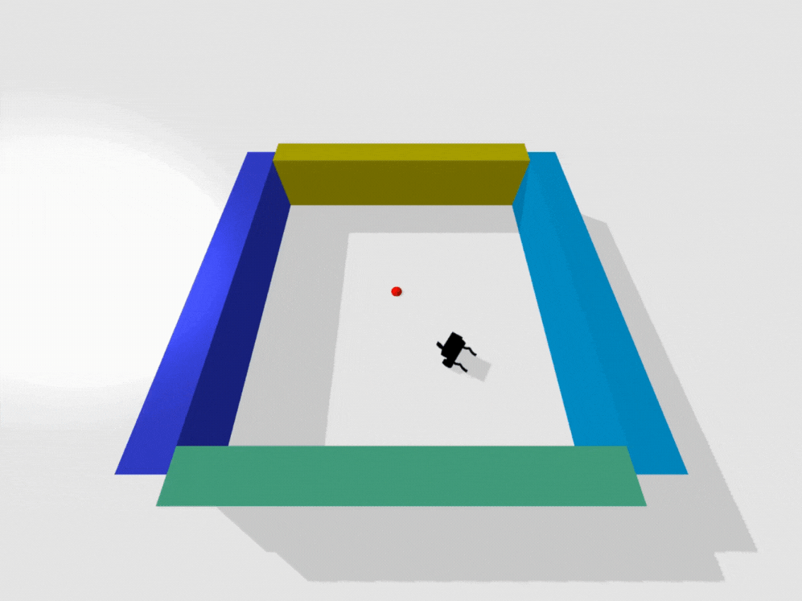
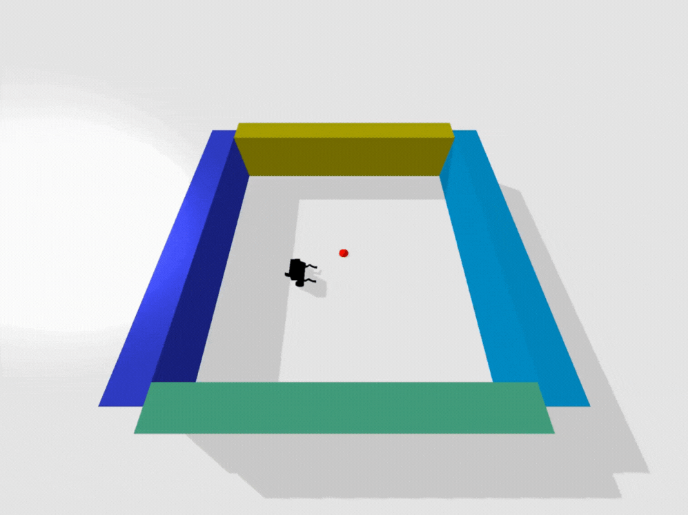
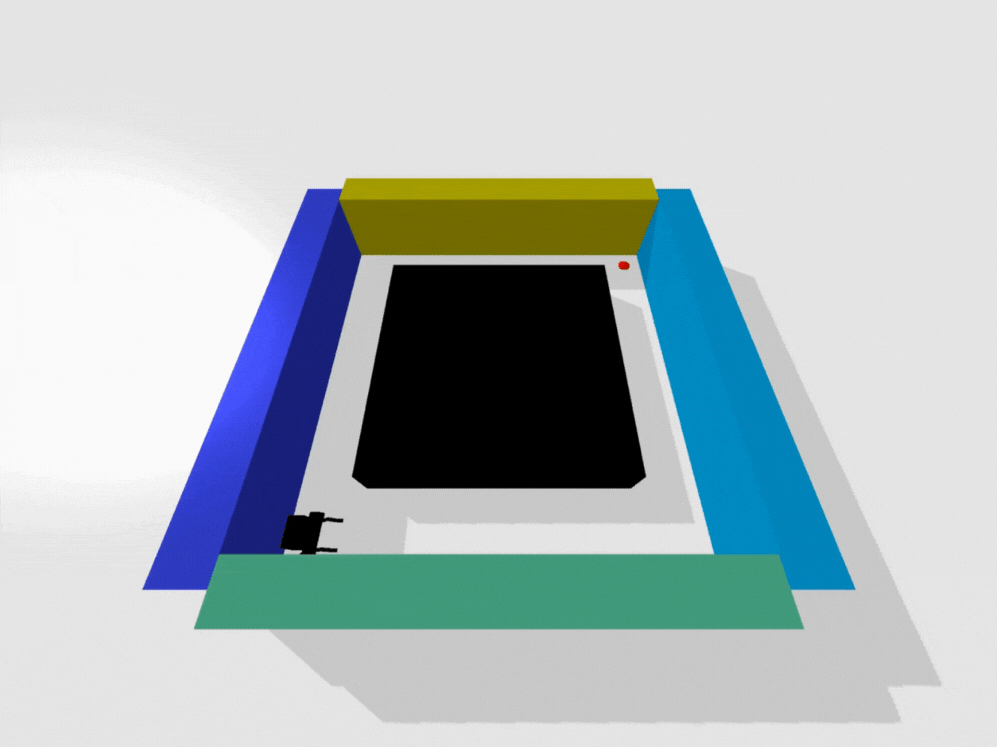
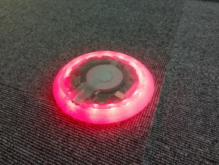
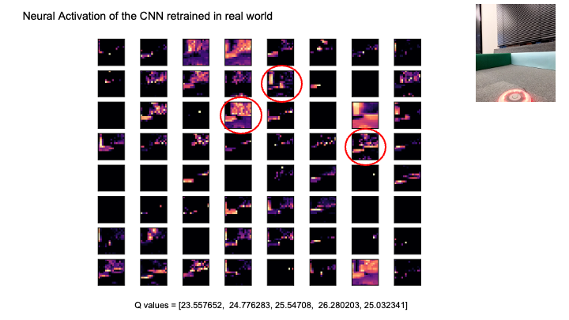

# Vision-Based Navigation on a Smartphone Robot via Deep Reinforcement Learning

<div align="center">
  
</div>

## Table of Contents

- [Overview](#overview)
- [Research Focus](#research-focus)
  - [Simulator & Robot Model](#simulator--robot-model)
  - [MDP Definition](#mdp-definition)
  - [Training](#training)
  - [Results](#results)
- [Simulation to Reality](#simulation-to-reality)
- [Key Findings](#key-findings)
- [Media Files](#media-files)

---

## Overview

A low-cost education & research platform that turns a smartphone into the brain and sensor suite of a small differential-drive robot.

The original [OIST repository](https://github.com/oist/smartphone-robot) has been archived; this page recaps what the project is about and summarizes my 2021 work. For more information about the research context, see the [OIST Neural Computation Unit - Adaptive Systems Group](https://www.oist.jp/research/research-units/ncu/adaptive-systems-group).

### Why Smartphone?
Built-in camera/IMU, decent on-device compute, and easy app deployment.

### Hardware Components
- Smartphone + motor driver + encoders/IMU + battery
- Optional Android-compatible I/O board (e.g., IOIO)

### Software Stack
- **Inputs:** camera (OpenCV), IMU, wheel encoders, mic (optional)
- **Control/Policy:** classic PID / compound controllers, or hooks for RL/IL policies
- **Outputs:** motor PWM/control, media/telemetry, simple networking

### Typical Applications
Color-blob following, local/remote PID control, back-and-forth motion, path/set-point tracking, docking/charging.

---

## Research Focus

As a foundation for a future multi-agent ecosystem, I focused on single-agent vision-based navigation capability. The concept is simple: the robot visually finds a **battery pack** and approaches it (a proxy for a basic survival behavior).

### Simulator & Robot Model

- **Physics simulator:** PyBullet
- **Robot model:** URDF derived from smartphone robot CAD; differential drive (independent left/right wheels)
- **Perception:** Monocular camera only; navigation uses vision alone (no odometry or mapping)

<!-- Media: URDF Model -->
<div align="center">
  
  <p><em>Smartphone robot URDF model in PyBullet</em></p>
</div>

### MDP Definition

- **Observation:** Monocular RGB frames with frame stacking (e.g., `32×32×3×5`)
- **Action:** 5 discrete actions (fixed left/right wheel angular velocities per action)
- **Reward:** Visual-likelihood term + distance reduction + goal completion bonus

#### Action Space

| Action     | (ω_left, ω_right) [rad/s] |
| ---------- | ------------------------- |
| Forward    | ( +5,  +5 )               |
| Backward   | ( -5,  -5 )               |
| Turn Right | ( +5,  -5 )               |
| Turn Left  | ( -5,  +5 )               |
| Do Nothing | (  0,   0 )               |

*Implementation uses DQN with discrete actions (policy selects from the 5 candidates above).*

<!-- Media: MDP Loop Diagram -->
<div align="center">
  
  <p><em>MDP loop: Observation → Policy → Action → Environment → Reward</em></p>
</div>

#### Reward Function

- `R_visual = 0.1` — State-conditioned visual reward indicating "target-likeness"
- `R_distance = distance(s) − distance(s')` — Distance reduction toward goal (Euclidean)
- `R_goal = 50` — Bonus upon reaching the goal

#### Simulator vs Real Device Challenges

**Simulator:**
- Environment computes distance to goal and supplies it
- "Goal reached" defined by distance threshold

**Real Device:**
- No direct distance oracle; distance-based reward requires additional sensing/estimation
- "Goal reached" tied to charging detection on Android (requires halt and dock)
- Camera FOV often loses battery near goal (severe occlusion/off-center close-up)
- Physical docking onto pack is nontrivial

### Training

- **Algorithm:** DQN with CNN encoder (experience replay, ε-greedy)
- **Data augmentation:** Lightly randomize initial pose/obstacles/textures to mitigate overfitting
- **Hyperparameters:** Tuned heuristically; formal benchmarking is out of scope

### Results

**Qualitative observations:**
- **Before vs After:** Random policy vs trained navigation behavior
- **Maze/Obstacles:** Sample behavior in maze-like scenes with obstacles

<!-- Media: Training Results Videos -->
<div align="center">
  <h4>Training Results</h4>
  <div style="display: flex; justify-content: center; gap: 20px; flex-wrap: wrap;">
    <div style="text-align: center;">
        
      <p><em>Random Policy</em></p>
    </div>
    <div style="text-align: center;">
        
      <p><em>Trained Policy</em></p>
    </div>
  </div>
  <div style="display: flex; justify-content: center; gap: 20px; flex-wrap: wrap; margin-top: 20px;">
    <div style="text-align: center;">
      
      <p><em>Maze Navigation Example</em></p>
    </div>
    <div style="text-align: center;">
      
      <p><em>Navigation with Obstacles</em></p>
    </div>
  </div>
</div>

---

## Simulation to Reality

The trained policy is converted to **TensorFlow Lite** and deployed to an Android device. The app receives inference commands and drives the left/right motors accordingly. Camera frames can be streamed to a server for **lightweight fine-tuning**, then the updated model is pushed back to the device.

### Scope
Hardware tests emphasize visual-response probing under appearance shifts—how the policy attends to and reacts to the battery pack on device—using TFLite deployment and motor I/O. Comprehensive autonomous docking is treated as follow-up work.

### Key Observations

**Challenges:**
- Real battery's saturation/texture differs from simulation → weak initial response
  - **HSV analysis** revealed significant color space mismatch (see configuration table below)
- No distance oracle on-device → could not realize distance-based reward used in simulation
- Goal detection required Android-side charging status; robot must stop and hold contact
- Near-goal occlusion: camera often loses target from view; docking geometry made final approach hard

**Solutions:**
- Short fine-tuning improved response to battery pack
- Grad-CAM heatmaps showed increased activation around battery after fine-tuning

<!-- Media: Battery Pack Analysis -->
<div align="center">
  <h4>Battery Pack Appearance Analysis</h4>
  <table style="margin: 0 auto;">
    <tr>
      <td style="text-align: center; padding: 10px;">
        
        <p><em>Battery Pack Target</em></p>
      </td>
      <td style="text-align: center; padding: 10px; vertical-align: top;">
        <h5>HSV Configuration</h5>
        <table style="margin: 0 auto;">
          <tr style="background-color: #f5f5f5;">
            <th style="padding: 8px;">HSV</th>
            <th style="padding: 8px;">High</th>
            <th style="padding: 8px;">Low</th>
          </tr>
          <tr>
            <td style="padding: 8px; font-weight: bold;">Hue</td>
            <td style="padding: 8px;">0.05</td>
            <td style="padding: 8px;">0.05</td>
          </tr>
          <tr>
            <td style="padding: 8px; font-weight: bold;">Saturation</td>
            <td style="padding: 8px;">0.7</td>
            <td style="padding: 8px;">0.2</td>
          </tr>
          <tr>
            <td style="padding: 8px; font-weight: bold;">Value</td>
            <td style="padding: 8px;">1.0</td>
            <td style="padding: 8px;">0.8</td>
          </tr>
        </table>
      </td>
    </tr>
  </table>
</div>

<!-- Media: Grad-CAM Analysis -->
<div align="center">
  <h4>Grad-CAM Visualization</h4>
  
  <p><em>Grad-CAM: Before → After Fine-tuning</em></p>
</div>

---

## Scope & Credits

**Android/Java app** (TensorFlow Lite + motor I/O) was implemented by [Christopher Buckley](https://github.com/topherbuckley), a lab technician.

**My contributions:** PyBullet simulator setup, DQN training & evaluation, sim→device handoff, HSV/Grad-CAM analyses.

---

## Key Findings

### What Worked ✅
- Pure-vision + DQN formed navigation behavior in physics-based environments
- Frame stacking and distance-delta rewards aided learning stability
- TFLite export and device I/O wiring were successful

### What Didn't ❌
- **Sim→Real gap in rewards:** Distance-based reward not available on-device without extra sensing/estimation
- **Goal detection complexity:** Relying on charging status required stop-and-dock, unlike sim's distance threshold
- **Perception at close range:** FOV/occlusion near pack and docking geometry hindered final approach

---

## Media Files

This repository includes the following media files for demonstration:

### Images
- `media/robot.png` - Main robot image (shown above)
- `media/robot_urdf.png` - URDF model screenshot
- `media/mdp.png` - MDP loop diagram
- `media/battery.png` - Battery pack photo with HSV analysis
- `media/gradcam.png` - Grad-CAM heatmaps comparison

### GIFs
- `media/random.gif` - Random policy behavior
- `media/trained.gif` - Trained policy behavior
- `media/maze.gif` - Maze navigation example
- `media/obstacle.gif` - Navigation with obstacles example

<!-- ### Repository Structure
```
docs/
  media/
    robot_urdf.png
    mdp_loop.png
    random.mp4
    trained.mp4
    maze.mp4
    real_frame.jpg
    pack_photo.jpg
    gradcam_before_after.png
scripts/
  train_sim.py        # Demo training script
  export_tflite.py    # TFLite conversion template
README.md
```

---

*This page reflects a personal recap of a 2021 effort. It is a clean-room, non-proprietary write-up and does not include upstream/private code or assets.* -->